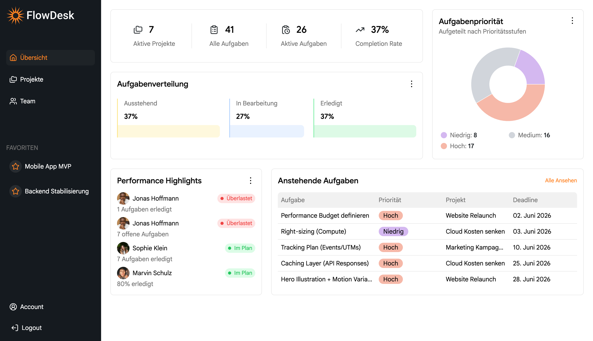
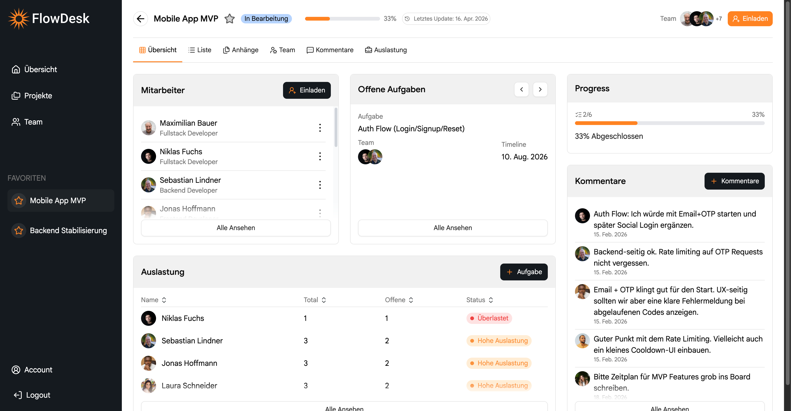
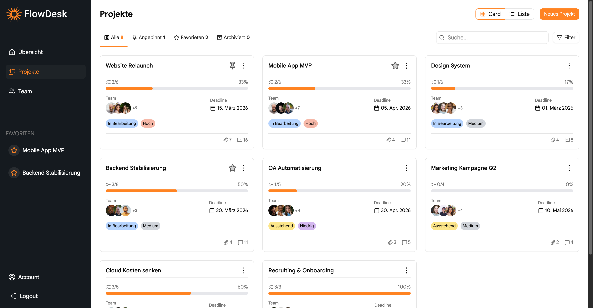
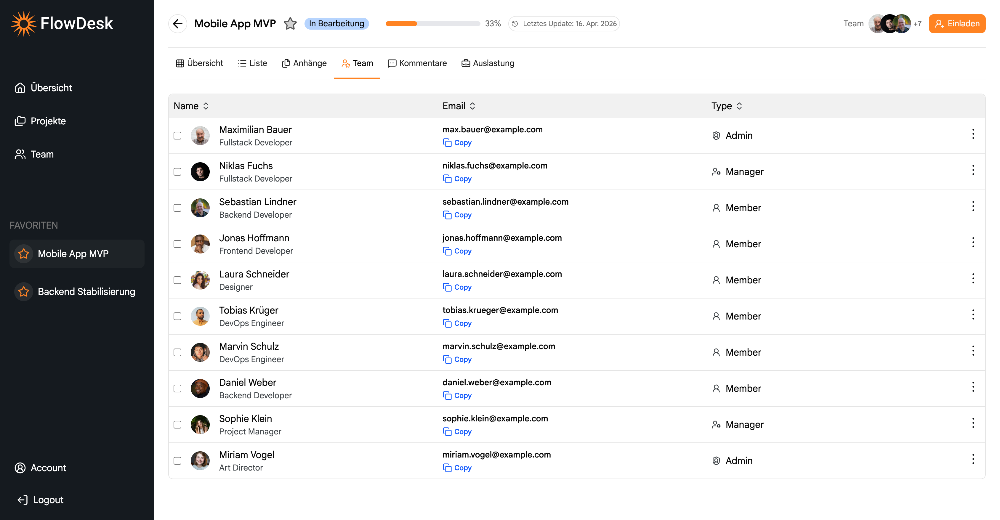
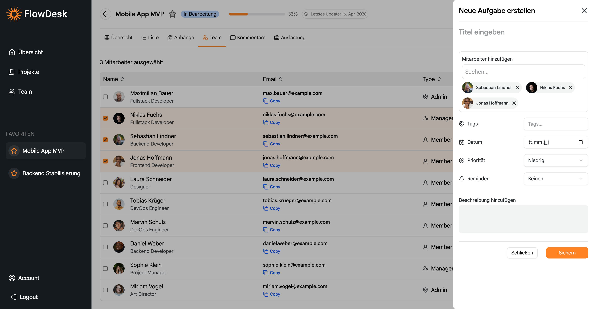
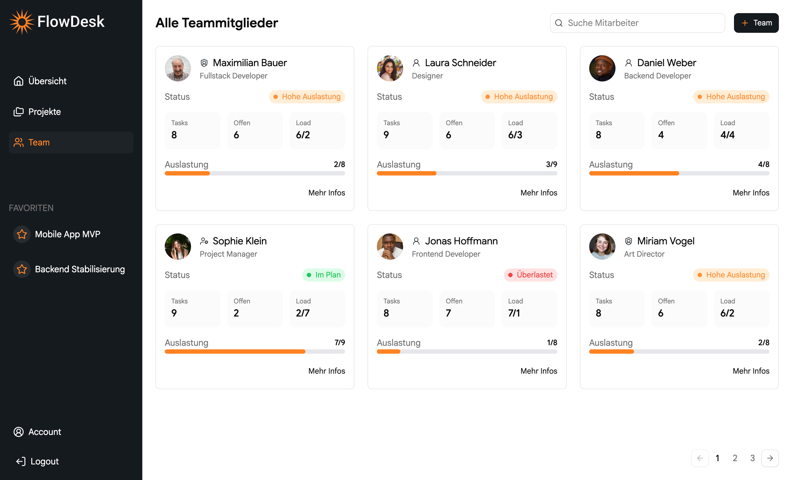

# FlowDesk

FlowDesk is an admin dashboard for managing projects, tasks, and team collaboration, with a focus on structured data handling, sorting, and UI-driven workflows.

⚠️ This project is still a work in progress. Many parts are not fully refactored yet, and the overall direction and features may still evolve.

## 🚀 Current Setup

- Fullstack setup with **React (Vite)** frontend and a **custom Node.js / Express** backend
- Backend handles **search, filtering, pagination, and data shaping**
- Data is fetched via structured endpoints and optimized with React Query
- Features are being developed iteratively, with ongoing refinements

## 🧠 Architecture Notes

- Filtering, search, and pagination are handled **server-side via query parameters**
- Backend currently uses a **file-based mock database** to simulate real API behavior and data transformations

##### Frontend state is **synchronized with the URL**, enabling:

- persistent state across refresh
- shareable links
- consistent data flow

## ⚠️ Current Limitations

- No authentication system yet → user-specific data (e.g. favorites, pinned items) is handled on the frontend only
- These values are not available on the backend and therefore cannot be used for server-side filtering

## ⏳ Planned Improvements

- Expand REST API with dedicated endpoints (dashboard, team details, etc.)
- Replace mock DB with a persistent database (MongoDB)
- Add authentication & user-based data handling (JWT)
- Improve caching strategy with React Query
- Refactor shared types and API contracts
- Add an Activity / History page for project changes, task updates, and user actions
- Refactor overall structure
- Create Attachment Tab
- Delete Domain folder completely and only handle in backend 
- Implement Framer Motion for animations
- Finalize layout/theme

## Installation

1. Clone the repository

```bash
git clone https://github.com/Marvin348/flowdesk.git
cd flowdesk
```

2. Install dependencies

```bash
npm install
```

3. Start the frontend

```bash
npm run dev
```

4. Start backend

```bash
cd server
npm run dev
```

## 🛠 Tech Stack

### Backend

- **Node + Express**

### Frontend

- **TypeScript**
- **React**
- **Axios**
- **Zustand**
- **react-hook-form + zod**
- **TanStack Query**
- **Tailwind CSS**
- **Recharts**
- **React Router**
- **shadcn/ui**

## Screenshots

<p align="center">
  
  
</p>

<p align="center">
  
  
</p>

<p align="center">
  
  
</p>

