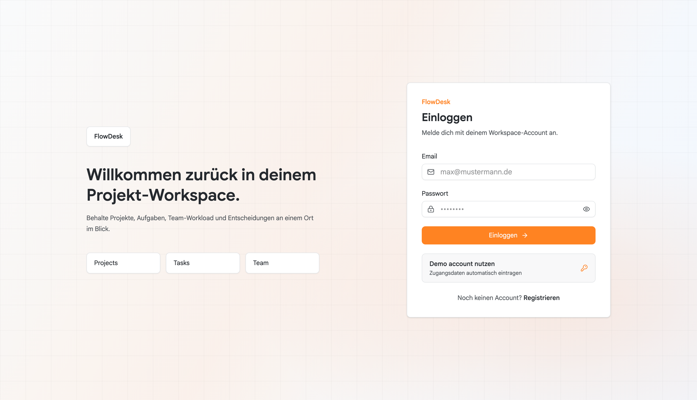
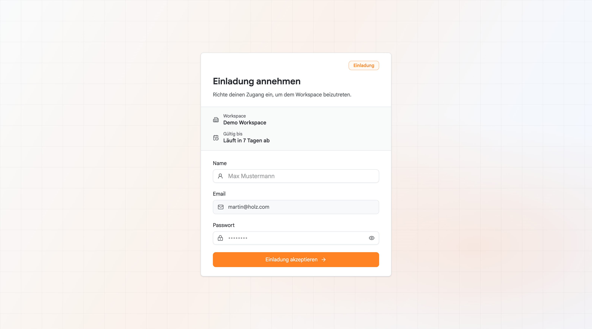
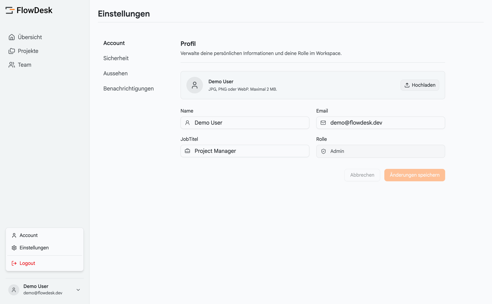
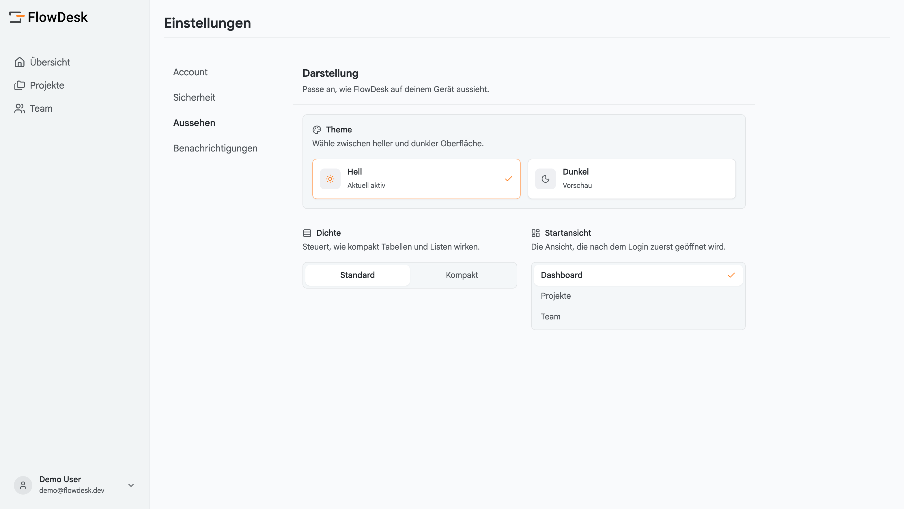
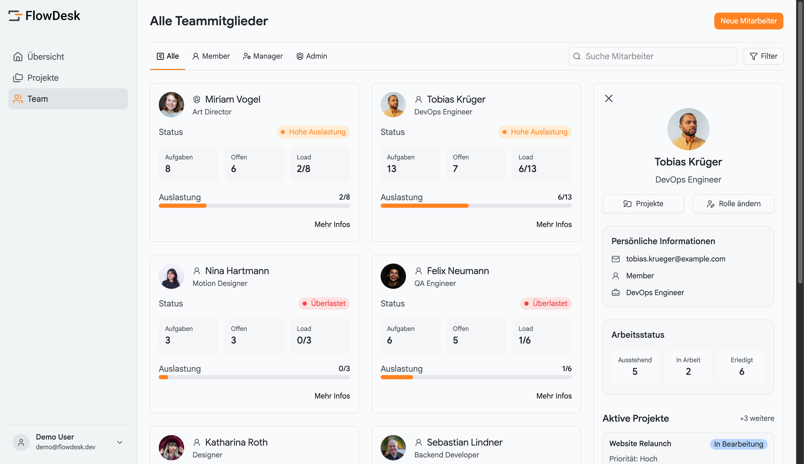

# FlowDesk

FlowDesk is a modern full-stack project management and workflow app focused on task management, team organization, and structured workflows.

The project focuses on real-world admin workflows such as project overview management, detailed project pages, task assignment, task status tracking, workload insights, attachment handling, workspace invitations, and backend-driven DTOs for clean frontend data consumption.

FlowDesk is actively being developed as a fullstack portfolio project with a focus on backend architecture, authentication, authorization, data modeling, file storage, testing, and clean API design.

## Tech Stack

### Backend

- **Node + Express**
- **MongoDB with Mongoose**
- **Redis + BullMQ**
- **Cloudflare R2 for private file storage**
- **Resend (E-Mail Provider)**
- **Zod**
- **Vitest and Supertest for backend testing**

### Frontend

- **React with Vite**
- **TypeScript**
- **React Router**
- **TanStack Query**
- **Axios**
- **Zustand**
- **react-hook-form + zod**
- **Tailwind CSS**
- **Recharts**
- **shadcn/ui**

### Infrastructure & Local Development

- **Docker**
- **Docker Compose**
- **Redis container for session storage**
- **Separate client and API containers for local development**

### Architecture Notes

FlowDesk uses a custom Express backend instead of a BaaS solution. The backend is responsible for authentication, authorization, validation, database access, file handling, and response shaping.

Authentication is handled through server-side sessions. On login, the backend creates a random session ID, stores the session data in Redis with a TTL, and sends the session ID to the browser in an HttpOnly cookie. Protected routes use a reusable requireAuth middleware that reads the session cookie, loads the session from Redis, and attaches the authenticated user context to the request.

Most API responses are shaped through DTO and mapper functions. This keeps frontend data predictable and avoids exposing database-specific fields such as \_id, \_\_v, or internal storage keys unless needed.

Data-heavy endpoints handle filtering, search, pagination, and aggregation on the backend. The frontend consumes already structured response data and uses React Query for caching and request state management.

### Authentication & Email Verification

New users are not activated immediately after registration. During registration, the backend creates a one-time email verification token and stores its hashed value together with the required verification data in Redis with a short TTL.

Only the latest verification token for a user and verification type remains valid. Reissuing a token atomically replaces the previous one.

When the user opens the verification link, the backend atomically validates and consumes the token from Redis. If the token is valid, the account is marked as verified and the temporary token state is removed immediately. Unused tokens expire automatically through Redis TTL.

This keeps short-lived verification state out of the primary database while ensuring that verification tokens are temporary, single-use, and safely replaced when a new token is requested.

### Realtime Notifications
FlowDesk uses Socket.IO for realtime notification updates.

When a notification is created by the background notification worker, the worker publishes a realtime event via Redis Pub/Sub. The API process subscribes to this channel and forwards the event to the affected user's Socket.IO room.

Each authenticated user joins a dedicated room.

### Rate Limiting

Sensitive authentication routes are protected by Redis-backed rate limits.

- Multiple identifiers are supported depending on the route, such as IP address, email address, or authenticated user ID.
- Rate-limit counters are stored in Redis with route-specific request limits and TTLs.
- Counter increments and expiration setup are executed atomically using a Lua script.
- Requests exceeding the configured limit return `429 Too Many Requests`.
- The remaining cooldown is exposed through the `Retry-After` response header.
- The frontend displays a dedicated rate-limit message with a countdown.
- Express `trust proxy` is configured so client IPs can be resolved correctly behind the production proxy.

### File Uploads & Downloads

FlowDesk stores uploaded files in Cloudflare R2 using S3-compatible APIs. The database stores file metadata such as filename, MIME type, file size, storage key, project reference, task reference, workspace reference, and uploader reference.

Downloads are handled through signed URLs. The backend first verifies that the authenticated user has access to the requested attachment and then redirects the user to a temporary signed download URL.

This keeps private files protected while avoiding unnecessary file streaming through the backend.

### Workspace Invites

Admins can create invite links for new workspace members. Invites are token-based, expire after a defined time, and can only be used once.

When an invited user registers through a valid invite link, they are added to the existing workspace instead of creating a new isolated workspace.

### Current Status

FlowDesk is still in active development. Core backend features such as authentication, project data, task data, file attachments, workspace context, email verification, and invite handling are already implemented or being actively refined.

The current focus is on improving route structure, service separation, backend tests, authorization checks, and production-readiness before deployment.

### Planned Improvements

- Improve workspace and role-based authorization
- Expand backend test coverage for all major routes
- Continue refactoring older routes into service-based architecture
- Improve frontend empty states and loading states
- Add more polished task and attachment interactions
- Improve profile and avatar upload handling
- Finalize production deployment setup
- Improve UI animations and layout polish
- Add more complete project activity and audit log features

## Installation

### Prerequisites

Make sure the following tools are installed:

- Git
- Docker Desktop

#### 1. Clone the repository

```bash
git clone https://github.com/Marvin348/flowdesk.git
cd flowdesk
```

#### 2. Create the backend environment file

Create a server/.env file based on the provided example:

cp server/.env.example server/.env

Then replace the placeholder values in server/.env with your own configuration.

#### 3. Build and start the application

Run the following command from the project root:

```bash
docker compose up --build
```

Docker Compose builds and starts the frontend and backend containers.

The application will be available at:

- Frontend: http://localhost:5173
- Backend: http://localhost:3001

After the initial build, you can usually start the application with:

```bash
docker compose up
```

### 4. Seed the local database

After the containers are running, seed the local MongoDB database with demo data:

```bash
docker compose exec api npm run seed
```

#### 5. Stop the application

Press Ctrl + C and then run:

```bash
docker compose down
```

## Screenshots












